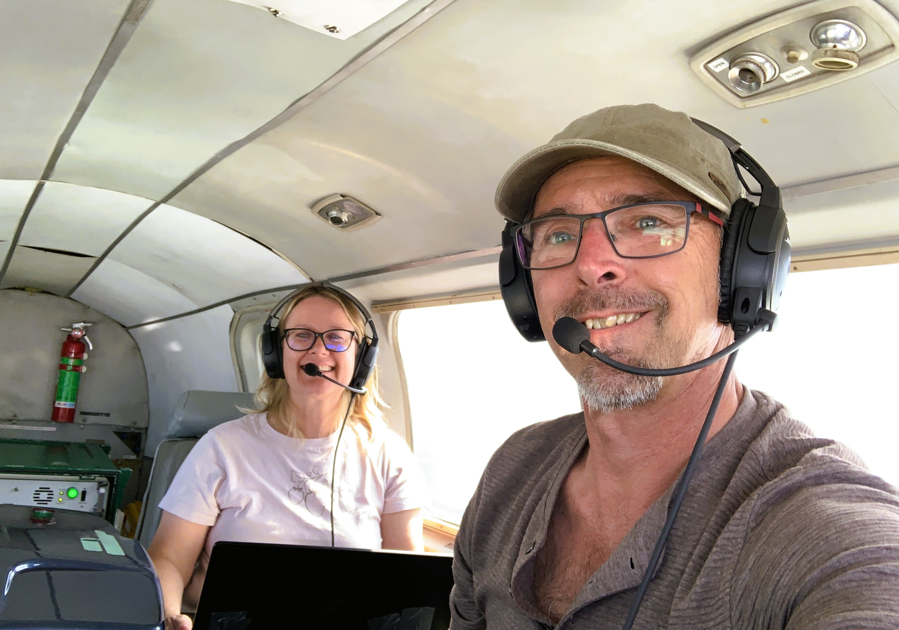
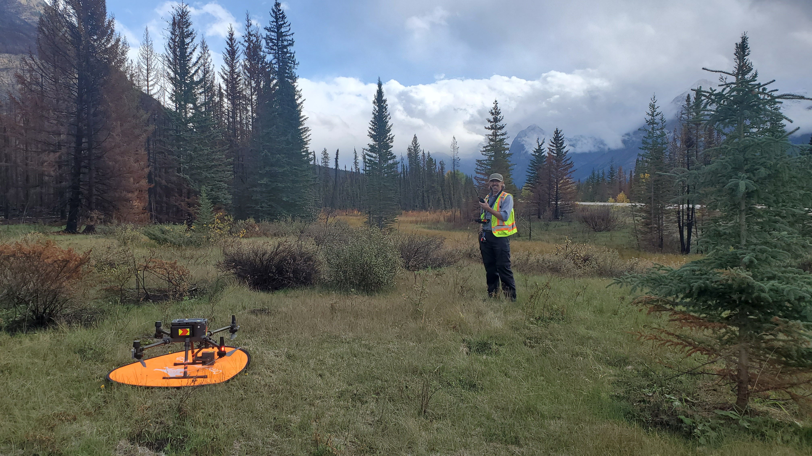
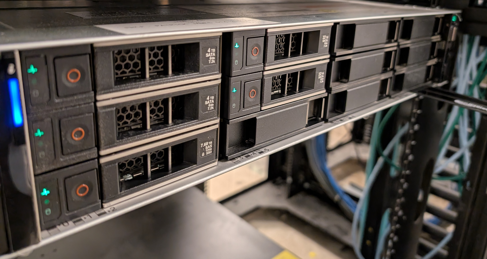

## Data Collection

In order to meet our research objectives, we need access to many lidar data sets. Much of the data used for this project is collected through our various lidar sensors:

### Aerial lidar

Aerial lidar (ALS), enables very large spatial coverage. Laura Chasmer and Chris Hopkinson at the University of Lethbridge collect ALS data with their in-house Teledyne Optech Titan sensor.

### RPAS lidar

Remotely Piloted Aircraft Systems (RPAS) are an excellent middle-ground between  ALS and terrestrial lidar. Typically drone-mounted, lidar sensors will capture higher density point clouds than ALS, although at a smaller spatial scale. 

### Terrestrial lidar

Terrestrial and mobile lidar systems trade spatial coverage for higher point cloud density. Whether in a fixed position set atop a tripod (terrestrial lidar scanners - TLS), or moving through the forest (mobile lidar scanners - MLS), provide rich data, and are typically thought to better capture subcanopy structure.

{fig-alt="A BLK TLS scanner in a jack pine forest in NorthWestern Ontario" width="2000"}

### Other data sources

We are lucky to collaborate with many scientists and foresters that operate lidar scanning equipment. In addition, we use publicly available data acquired by federal and provincial government agencies.

## Data Processing

The high density lidar data our teams work with require heavy computational equipment. The data takes a lot of space, requiring large storage solutions, as well as machines with a lot of memory to read in the data during analysis. Some of the computation we do is on our own hardware, but we also have access to the Digital Research Alliance of Canada's supercomputers.

{fig-alt="A computation server on a server rack" width="2000"}
